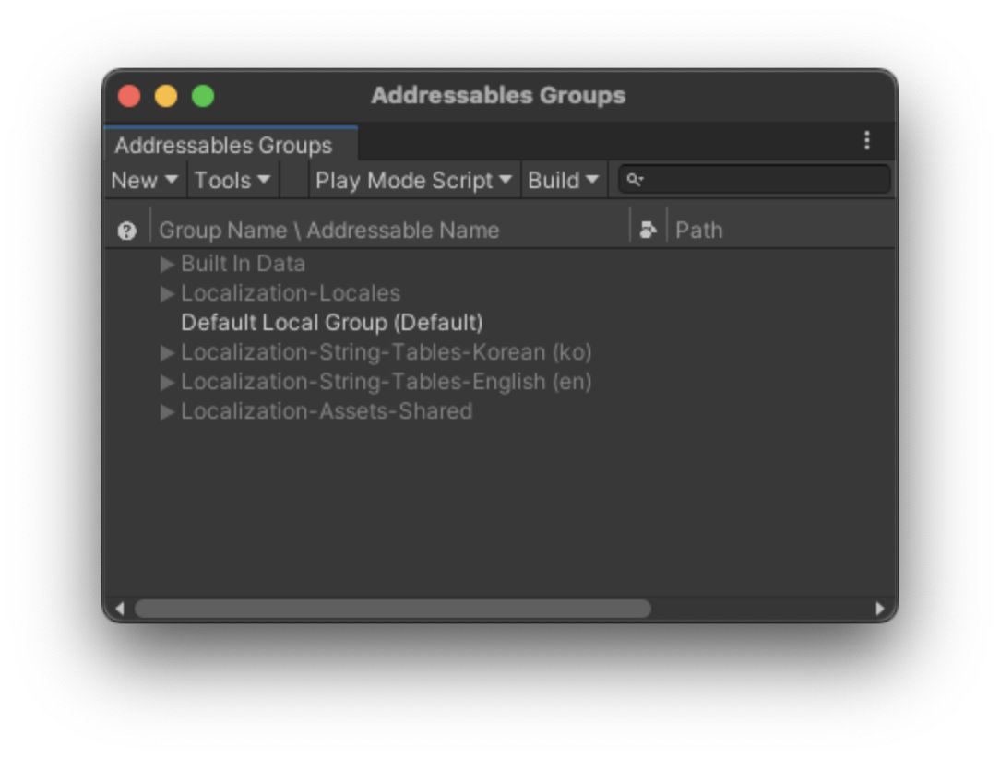

# Localization

Script part of the localization supports in this project.

## How it works

The localization system is based on the Unity Localization package.

**1. Load localization data from localization tables.**

Unity Localization package uses `Localization Tables` to store localization data. It exists in the `/Assets/Localizations` folder as specific `.asset` files. Each localization table contains a list of `Localized String` assets. Each `Localized String` asset contains a key-value pair of a string in a specific language.

But the `.asset` format is hard to manage and edit. So "Prototype Table" is used to manage the localization data. It exists in the `/Assets/Resources/LocalizationSupports/PrototypeTable` folder as a `.csv` file that Unity supports to import as a `Localization Table`.

In summary, the localization data is managed and edited in the `Prototype Table`(=Edit only) and then imported into the `Localization Table`(=Import only) to use in the game.

\*Note: The `Prototype Table` is not used directly in the game. It is only used to manage the localization data.

\*Note: To make convinient to manage the localization data by each language, the `Prototype Table` can be seperated by each language. (e.g. `SystemSupports.en.csv`, `SystemSupports.ko.csv`) In this case, Using "Locale Table Generater" is recommended to merge the seperated tables into one table. It is simple Python scripts that can be found in the `/Assets/Resources/LocalizationSupports/LocaleTableGenerator` folder.

**2. Read system's locale and apply to the game.**

The `LocalizationManager` class is a singleton that manages the localization of the game. It sets game's locale based on the operating system's locale configuration. (When system's locale is not supported, it defaults to English. Refer to the `Cafe.Localization.Definitions.AvailableLocales` enum for supported locales.)

## When building the game

When building the game, the localization data is included in the build. But the localization data is not included in the build by default.

To include the localization data in the build, the Localization Table must be built as an `Addressable Asset`. You can build at "Addressables Groups" window that can access through `Window > Asset Management > Addressables > Groups`. In the `Addressables Groups` window, select the `Build > New Build > Default Build Script` menu.

For more information, refer to the Unity Localization package documentation.

https://docs.unity3d.com/Packages/com.unity.localization@1.2/manual/QuickStartGuideWithVariants.html#preview-and-configure-your-build
